# My Favourite Recipes Test Evidence
## Unit and Functional Testing

####    Navigation
The navigation bar needs to work consistently across all pages. It needs to take the website user to where they want to go and where the label says. The layout of the navigation bar needs to be clean, easily understood and consistant across the site. On medium and small devices the inital navigation bar appears as the 'hamburger' icon which, when clicked produces the navigation down the side of the screen. When the side navigation is clicked again it will disappear.
#####   Nav Bar on Large Devices
 
#####   Nav Bar on Medium Devices
 
#####   Nav Bar on Small Devices
 
#####   Nav Sidebar on Medium Devices
 
#####   Nav Sidebar on Small Devices
 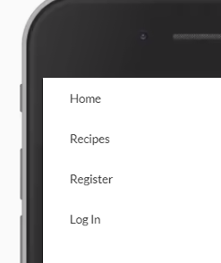

Each of the navigation links takes the webiste user to the relavent pages.

####    Footer
The footer allows for the addition of information and links to sites that are not directly part of this site. The website user can find information about the creator of this site. In the real world these links would be for other company information. The website user has access to be able to contact the owner of the site. The link for the weights and measure takes the website user to the BBC Good Food unit conversion page. For a corporate site it would be preferable to completely recreat this information and not link to outside the site.

#####   Footer on Large Devices
 
#####   Footer on Medium Devices
 
#####   Footer on Small Devices
 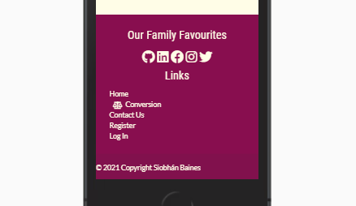
####    Github
The link to Github opens in a seperate window.
 
####    LinkedIn
The link to LinkedIn opens in a seperate window.
 
####    Facebook
The link to Facebook opens in a seperate window.
 
####    Instagram
The link to Instagram opens in a seperate window.
 
####    Twitter
The link to Twitter opens in a seperate window.
 
#####   Weights and Measures link
This links to an external website [BBC Good Food](https://www.bbcgoodfood.com/conversion-guides). To create this within my site would have been creating a full website so I decided to simply create the link.
######  Large Devices
 
######  Medium Devices
 
######  Small Devices
 

####    Home Page
#####   Home Page Large
There is a strange issue with the home page where by when the site is opened on a desktop and all navigation is done on that resolution the navigation bar fits the whole window and there is no horizontal scroll bar.
 
If the same page is inspected using DevTools and then DevTools is closed a horizontall scroll bar appears.
 
To fix the issue I had to ass some styling for the .nav-extended class to force the bar to being the full width and then had to add some padding to the right of the ul element so that all them navigation options were still visible.

#####   Home Page Medium
 
#####   Home Page Small
There is an issue when moving between device sizes where the home page, parallax image does not cover the whole of the container.
 
I tried to fix this by removing some of the CSS styling for the .parallax-container class so that it only contained the overlay to lighten the image which enabled the materialize CSS. Although this looked like it worked initially, when I reloaded and ran some more tests the issue stayed the same
######  Parallax Materialize Issue
After much investigation I have come to the conclusion this is an intermittent issue with the materializecss styling for the parallax class. I thought it was related to the carousel I have on top of the background image but found I have the same issue on other pages where there is no background image. something happens to change the element.style but I have not been able to uncover the exact issue.
 
 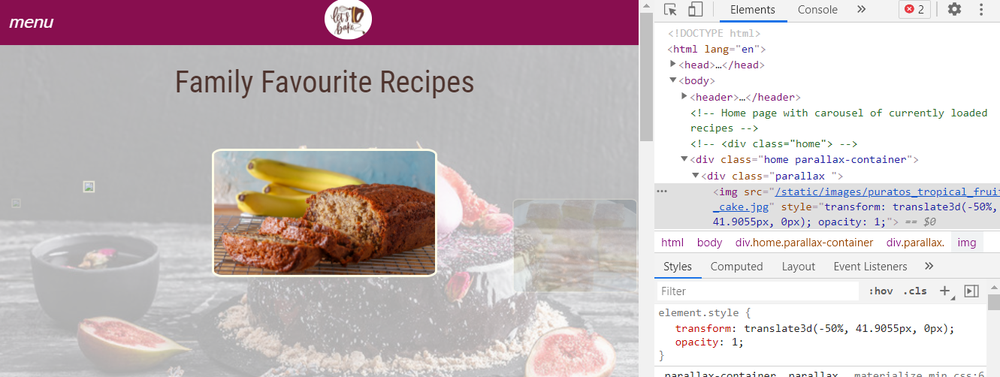
 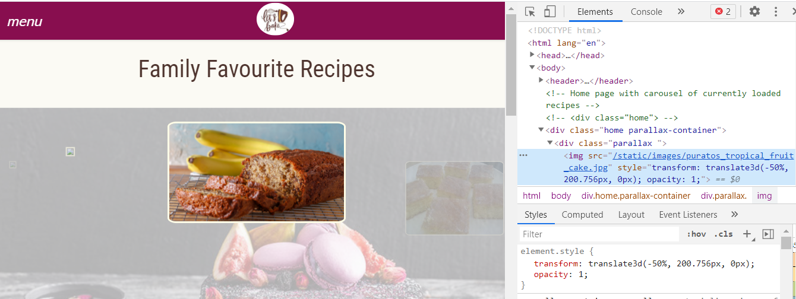
 
 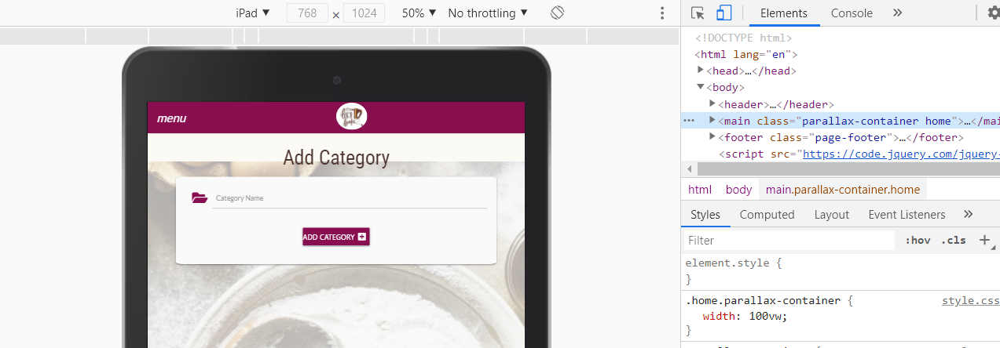

####    About Page
The about page has no functionality to test but the format for UX needs to be validated across all device sizes.
There is an issue with white space on either side of the about container.
  
This issue occured because the class container is a materialize class which has a set width that is smaller than the full view width of a screen. By changing the classes from .container .about to .container-about in both the HTML and CSS the issue is resolved.
#####   About Page Large
 
#####   About Page Medium
 
#####   About Page Small
 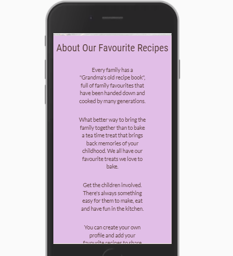

####    Getting Started Page
The getting started page has one button which allows the website user to register with the site to allow them to add their own recipes. This button works.
#####   Getting Started Large
 
#####   Getting Started Medium
 
#####   Getting Started Small
 

####    Recipes Page
The recipe page will grow in length as more recipes are added. Clicking on one of the recipe cards will take the website user to the recipe detail page. Each recipe shows how many people have liked or disliked each recipe. 
#####   Recipes Page Large
 
#####   Recipes Page Medium
 
#####   Recipes Page Small
 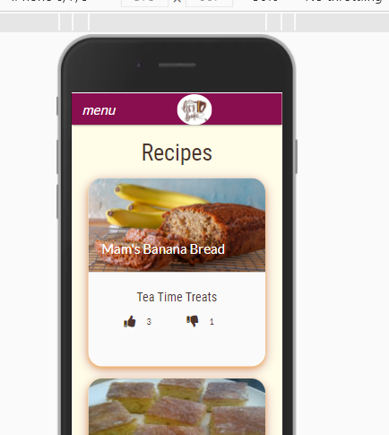
**Issues**
1. When an image is uploaded it will need to be resized so that when it is displayed the image does not pull out of shape.
2. If there is no image a default image is needed and the recipe title font colour will need to darken.
**Resolutions**
1. Using google to search for resizing of images using Python I found [auth0.com](https://auth0.com/blog/image-processing-in-python-with-pillow/#Resizing-Images)
2. Added default image code to HTML and added a new class with CSS to change the recipe title from white to brown so that it can be read.
 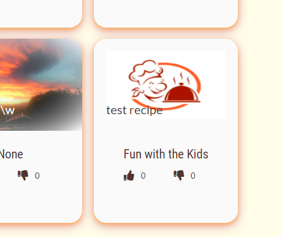
####    Register Page
The website user needs to register to be able to add any new recipes or categories which they will subsequently be able to read, change or delete later. (investigate - being able to stop user deleting categories used by other recipes) 
1. The individual needs to decide on a username and password. Both can consist of upper and lowercase letters and numbers and must be between 5 and 15 characters in length. 
If the username is too short the entry line changes to red and when the cursor is hovered over the line the message "Please match the requested format." appears. 
* Here the username is too short

* Here the user wanted to use special characters which are not allowed.
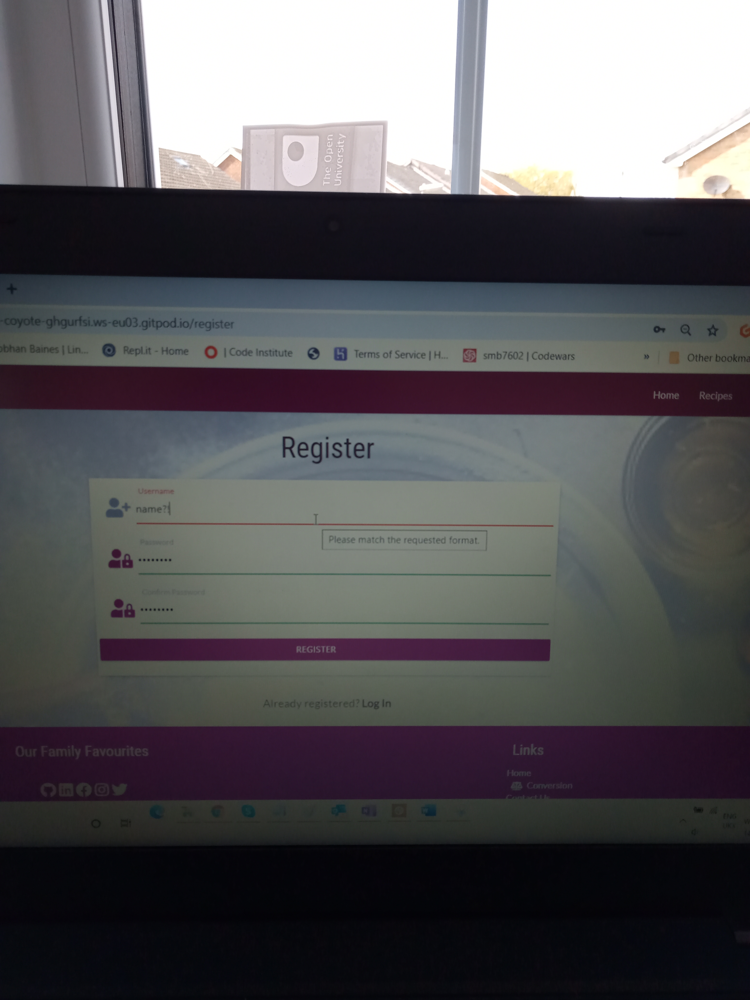
* The user has entered a valid username and the HTML formating has stopped the user entering more than 15 characters.

* If the user selects a username that already exists the receive a flash message

2. Both passwords must be identical. 
* Here the passwords do not match and a flash message is displayed.

3. If a user already has an account they can click the link to take them to the log-in page.

4. When the website visitor creates a valid username and password, the password in encrypted using Flask Werkzeug security, a record is added to the user collection in MongoDB and the user is taken to their profile page.
* MongoDB record

* Profile page of a new account

#####   Register Page Large
 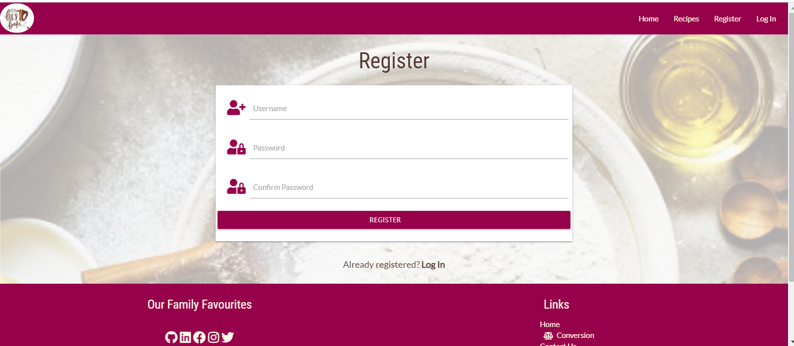
#####   Register Page Medium
 
#####   Register Page Small
 

####    Log-in Page
Once the website user has an account they can log in and out whenever they need.
1. The username and password are validated against the user collection in MongoDB to confirm the username exists and its password is correct.
* If the user enters either an invalid username or incorrect password a flash message is displayed. The same message is displayed for both errors to help prevent hacking.

3. If a user is not register there is a link to the registration page.

#####   Log-in Page Large
 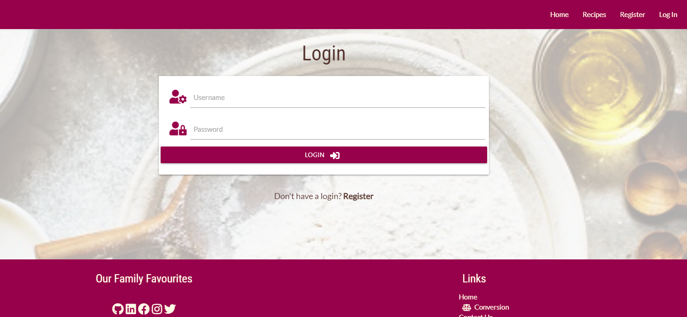
#####   Log-in Page Medium
 
#####   Log-in Page Small
 
####    Log-out

###     Profile Page
Below is an image of the profile page for a new user which shows a message saying they have not added any recipes and has a place to upload an image of themselves if they want to.
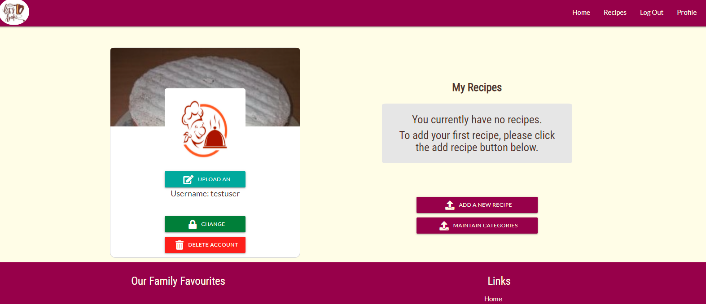
**Issues**
The text on the buttons on the profile card are truncated.
**Resolution**
I increased the button width from 12rem to 14rem.
From this page a website user can change their password, delete their account (which will delete all the recipes they have created), add a new recipe, maintain categories. When the website user has added some recipes a table is displayed detailing the recipes they have added. Clicking on the recipe name will take them to a read-only view of the recipe or they can click on the maintain recipe button to change or delete the recipe.

#####   Profile Page Large
 
#####   Profile Page Medium
 
#####   Profile Page Small
 

####    Display Recipe Page
#####   Display Recipe Page Large
 
#####   Display Recipe Page Medium
 
#####   Display Recipe Page Small
 

####    Add Recipe Page
#####   Add Recipe Page Large
 
#####   Add Recipe Page Medium
 
#####   Add Recipe Page Small
 

####    Edit Recipe Page
#####   Edit Recipe Page Large
 
#####   Edit Recipe Page Medium
 
#####   Edit Recipe Page Small
 

####    Add Category Page
#####   Add Category Page Large
 
#####   Add Category Page Medium
 
#####   Add Category Page Small
 

####    Edit Category Page
#####   Edit Category Page Large
 
#####   Edit Category Page Medium
 
#####   Edit Category Page Small
 

####    Contact Us Page
#####   Contact Us Page Large
 
#####   Contact Us Page Medium
 
#####   Contact Us Page Small
 

## Lighthouse Testing

## User Story Testing

